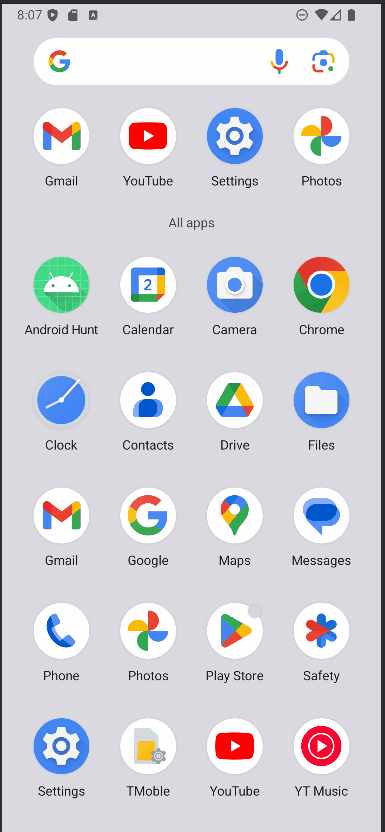

<!-- (This is a comment) INSTRUCTIONS: Go through this page and fill out any **bolded** entries with their correct values.-->

# AND101 Lab 1 - Android Treasure Hunt 🏴‍☠️!

Submitted by: **Matthew Wyatt**

Time spent: **1.5** hours spent in total

## Summary

**Android Treasure Hunt!** is an android app that recreates the common "Hello, World!". Find clues disguised as characters in surrounding brackets [Char] and unscramble the word to locate the treasure.

If I had to describe this project in three (3) emojis, they would be: **🏴‍☠️🗺️🏆**

## Application Features

<!-- (This is a comment) Please be sure to change the [ ] to [x] for any features you completed.  If a feature is not checked [x], you might miss the points for that item! -->

The following REQUIRED features are completed:

- [x] Clue #0: J
- [x] Clue #1: E
- [x] Clue #2: T
- [x] Clue #3: P
- [x] Clue #4: A
- [x] Clue #5: C
- [x] Clue #6: K

The following STRETCH features are implemented:

- [x] Bonus: Easter Egg: [https://youtu.be/dQw4w9WgXcQ](https://youtu.be/dQw4w9WgXcQ)

The following EXTRA features are implemented:

- [x] List anything else that you added to improve the app!

## Video Demo

Here's a video / GIF that demos all of the app's implemented features:

GIF created with **[ScreenToGif](https://www.screentogif.com/) for Windows**

<!-- Recommended tools:
- [Kap](https://getkap.co/) for macOS
- [ScreenToGif](https://www.screentogif.com/) for Windows
- [peek](https://github.com/phw/peek) for Linux. -->

## Notes

The treasure hunt leads to a **JETPACK** while the bonus easter egg leads to a **music video** (RICK ROLL).

## License

    Copyright 2025 Matthew Wyatt
    
    Licensed under the Apache License, Version 2.0 (the "License");
    you may not use this file except in compliance with the License.
    You may obtain a copy of the License at
    
        http://www.apache.org/licenses/LICENSE-2.0
    
    Unless required by applicable law or agreed to in writing, software
    distributed under the License is distributed on an "AS IS" BASIS,
    WITHOUT WARRANTIES OR CONDITIONS OF ANY KIND, either express or implied.
    See the License for the specific language governing permissions and
    limitations under the License.
